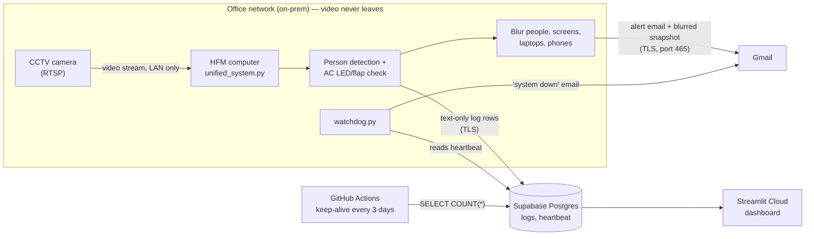

# HFM Energy Saving Detection — Handover for the Server Team

## 1. What the system does

An existing office CCTV camera watches a meeting room. Software on an
on-prem computer checks, several times per second:

- **Is anyone in the room?** (AI person detection, YOLOv8n)
- **Is each AC on?** (reads the AC's LED display and flap from the picture)

If the room is **empty while an AC is on** for a short time, it emails an
alert with a **privacy-blurred** snapshot. When someone returns or the AC is
switched off, it sends a "resolved" email. Every 30 seconds it records a
small text log line (room, empty/occupied, AC on/off, people count, time) in
a cloud database, which feeds a web dashboard.

## 2. Architecture



### On-prem (inside the building)
- Camera feed, AI processing, blurring and alert sending all happen on the
  HFM computer.
- **Video and snapshots never leave the building except as a blurred
  snapshot inside the alert email.** Nothing is saved to disk.

### Cloud
- **Supabase (Postgres):** only anonymous, structured event rows: room
  name, EMPTY/OCCUPIED, AC1/AC2 ON/OFF, people count, alert flag, timestamp.
  No images, no video, no names.
- **Streamlit Community Cloud:** dashboard that reads those rows.
- **GitHub:** source code (public repo, no secrets) + keep-alive job.

## 3. Privacy controls

| Control | How |
|---|---|
| Blurring | People, TV/monitors, laptops, keyboards and phones are pixelated before any snapshot is emailed (detection at high resolution, so small/far screens are caught); the rest of the room stays clear so the empty room and AC are visible. Optional strict mode (`BACKGROUND_PIXELATE`) also lightly pixelates the whole picture except the ACs. Extra fixed areas can be added (`zone_picker.py` → `FIXED_ZONES` in `privacy_blur.py`). If blurring fails, the email is sent **without** an image. |
| No identity | No face recognition and no identification of any person. Only a head-count. |
| No phone tracking | Phone detection and the phone count were removed from detection and logging. |
| No stored footage | Frames live only in memory. Nothing is written to disk. |
| Retention | Log and heartbeat rows older than **90 days** are deleted automatically once a day (`RETENTION_DAYS` in `unified_system.py`). |
| Email copies | `retention_cleanup.gs` runs daily on the sender's and the receiver's Gmail and permanently deletes HFM alerts older than 1 day. Where Gmail IMAP is allowed, the system also deletes its sent copy immediately. (IMAP is currently disabled for the company domain; the script covers it.) |
| Secrets | Passwords and URLs live only in `.env` on the HFM computer (git-ignored), in Streamlit secrets and in a GitHub Actions secret. Never in the code. |
| Database security | Password-protected Postgres (Supabase). Every connection is forced to use TLS (`sslmode=require`); Supabase encrypts stored data at rest. Access: only the project owner's Supabase account and holders of the connection string (HFM computer, dashboard, keep-alive job). |
| Dashboard access | Streamlit app should be set to *Only specific people can view* (app Settings → Sharing) so occupancy data is not public. |

## 4. Server requirements (24/7 host)

Measured: YOLOv8n at 640 px on a 2560×1440 frame ≈ **45 ms per frame** on 4
Xeon cores (≈ 20 frames/s). The program processes every new camera frame,
so it will use **most of the CPU** continuously. Peak memory ≈ **1 GB**.

| Item | Recommended |
|---|---|
| CPU | 4 cores (Intel i5 8th gen or better / equivalent). No GPU needed. |
| RAM | 8 GB (program uses ~1–1.5 GB) |
| Disk | 10 GB free (Python + libraries ≈ 3 GB). No footage is stored. |
| OS | Windows 10/11 or Linux (Ubuntu 22.04+) |
| Python | 3.11 (conda env `hfm_energy` today) |
| Install | `pip install -r requirements-local.txt` + `yolov8n.pt` model file (auto-downloads once from GitHub, or copy it in) |

### Network access needed
| Direction | Destination | Port | Why |
|---|---|---|---|
| LAN | Camera IP | TCP 554 (RTSP) | video stream |
| Outbound | Supabase pooler host (`*.pooler.supabase.com`) | TCP **5432** (session pooler) | log rows / heartbeat |
| Outbound | `smtp.gmail.com` | TCP 465 | send alert emails |
| Outbound | `imap.gmail.com` | TCP 993 | delete sent copies |
| Outbound (once) | `github.com` | TCP 443 | first download of `yolov8n.pt`, `pip install` (PyPI) |

No inbound ports are needed.

## 5. Running as a service

### Windows (current setup)
`run_system.bat` restarts `unified_system.py` automatically if it stops.

Start it at boot with **Task Scheduler**:
1. Task Scheduler → *Create Task…*
2. General: name `HFM System`, *Run whether user is logged on or not*.
3. Triggers: *At startup*.
4. Actions: *Start a program* → `C:\hfm_energy_project\run_system.bat`,
   *Start in*: `C:\hfm_energy_project`.
5. Settings: untick *Stop the task if it runs longer than…*.

Repeat for the watchdog with a `run_watchdog.bat` that runs `python watchdog.py`.

### Linux (systemd example)
`/etc/systemd/system/hfm.service`:
```ini
[Unit]
Description=HFM Energy Saving Detection
After=network-online.target
Wants=network-online.target

[Service]
User=hfm
WorkingDirectory=/opt/hfm_energy_project
ExecStart=/opt/hfm_energy_project/venv/bin/python unified_system.py
Restart=always
RestartSec=5

[Install]
WantedBy=multi-user.target
```
Create `hfm-watchdog.service` the same way with `watchdog.py`, then:
`sudo systemctl enable --now hfm hfm-watchdog`.
`.env` must be in `WorkingDirectory` and readable only by the `hfm` user
(`chmod 600 .env`).

### Watchdog
`watchdog.py` checks every 30 minutes that the main program wrote a
heartbeat in the last 2 hours, and emails "WARNING: HFM System Down" if not.
**Best practice:** run the watchdog on a *different* machine than the main
program, so it can still alert you if the HFM computer itself is off.

## 6. Open items for other teams

| Team | Item |
|---|---|
| **IT / Network** | Put the camera on a restricted VLAN; allow only the HFM computer to reach it on 554. Allow the outbound ports in section 4. |
| **IT** | **The camera's on-screen date shows 1970.** Set its clock / NTP server so snapshots show the correct date and time. |
| **HR** | Employee notice that the meeting-room camera is used for anonymous energy monitoring (no identification, blurred snapshots, 90-day retention). |
| **Security** | Confirm the 90-day retention period and the 1-day email retention. |
| **Server** | Choose and provision the final 24/7 host (section 4) and move the service there. |

## 7. Day-to-day operation

- Terminal shows one line every 30 s, e.g.
  `>> LOGGED: t=60s | DAY | EMPTY | AC1=ON AC2=OFF | People=0 | EmailSentNow=False`
- Night (lights off, IR camera) shows `NIGHT`. AC thresholds for night are
  set with `calibrate_ac.py --mode night`.
- Dashboard times are Pakistan time (PKT).
- Supabase free projects pause after ~7 days without activity; the GitHub
  keep-alive job prevents that (needs the `DATABASE_URL` Actions secret).
